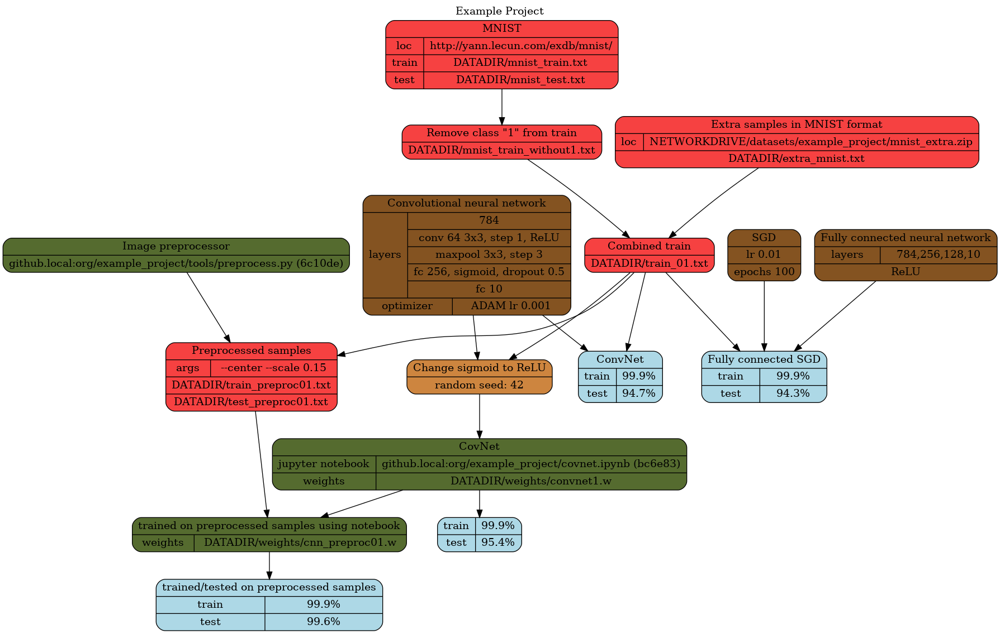

### Introduction:

Data science projects are messy (in my experience), and making sense of what was done, how it was done and where parts of it are is not simple.
`borked` is a concept proposal and (some day) quality-of-life tools for a graph based way of tracking work done.

The graph building is backed by `dot` tool from [Graphviz](https://www.graphviz.org/).

Below is an imaginary project visualisation that demonstrates the basic idea. It does not look pretty for a couple of reasons.
* inventing imaginary projects for examples is not my idea of fun (I hope to have a real project to show eventually)
* writing dot by hand is not exactly smooth (quality-of-life tools I want to make will generate dot from a more abstract format)
* experiments, data pipelines, new data, collaboration, bugs, etc. quickly make the best laid plans fall apart

The whole idea is to alleviate the trouble from the final point. The main focus is on a compact overview and dependencies tracking, which should hopefully aid reproducibility and help ensure you are using latest data/models/tools when experimenting.

Basic nodes have been color-coded: data (red), models (brown), resources (green), statistics (blue).
The light-brown node is a model variant, meant to indicate only a couple of parameters are being changed.

Properties are generally inherited and not reiterated if they can be easily backtracked through the graph.
The node type is meant to be flexible so graph clutter is reduced.
If you do a lot of experimenting with a model but rarely change data, make the model node dependent on the data node (or add a node dependent on both).
Even if the node is not of data type, it is assumed the nodes that come out still rely on the same data node.
If you do change the dataset, and want the latest model to rely on it instead, just connect them.
A shorter path should imply replacement (or you can be nice and comment on it in node label or in graph definition code).

If there is a concept that is missing, just add it. (stuff like taking out parts of different models and combining them)
You can always fall back to short explanations in labels, more detailed in graph definition comments, or refer to external resources.

This should also make naming files more tolerable, since `weights/cnn_preprocessed01.w` is no longer a test of memory and deduction as the graph clarifies what that is even without a refined naming convention.

Finally, this should give you a better idea of the fragility of your setup.
Is everything important to you in version control or backed up?
If bad things happen can you retrieve and recreate the dataset you are using?
Do you have a ipython notebook/script with your experiment setup that is relatively recent? Do you know all the modifications you did to it that led to that latest great result?
Even if nothing bad happens, if there is someone new that should start working with you, you still need a way to bring him up to speed and explain where you're at.

Since the graph definition is text, version control is an obviously sane way to manage it.
The usual benefits are:
* keeping track of changes; you can update/fix/tidy your graph without history being lost
* collaboration
* metadata; one of the options of the QoL tools I intend to add is chronological ranking of nodes via git-blame
* git is awesome

The graph itself is not meant to be the record of absolutely everything done, version control and task tracking software can do that.
Put stuff in the graph only if something of note relies on it, and remove stuff from the graph if it becomes overly redundant (for example squashing multiple smaller iterations when hitting a major version).
Branching in version control can also help reduce clutter while allowing detailed tracking of an experimental track.
If you are feeling adventurous you could try branching and have automated parameter optimization (ala grid search) output nodes to the graph as a way of logging (it makes more sense if your model variants are less homogeneous).

Cleaning up. Not everything remains important.
If something is mentioned in the graph (<code>grep -r <i>file</i> graph/</code>), you probably don't want to delete it by accident.
If you run into something not mentioned by the graph it is safe to be cleaned up (for datasets maybe you should mention data directories as well as file list for this intent in the graph).
When you decide something is no longer necessary to keep, you can update the graph, and note in the commit that it is indeed gone.

Current issues:
* dot language is a handful
* graph definition is in a single file (unwieldy for bigger graphs)
* the graph concepts are still very basic

Work planned:
* add a simpler and more abstract graph definition format and a tool for parsing and generating dot format
* add ability to split definition into multiple files and support for namespaces
* add ability to plot only subgraph leading to one node of interest, for dependency inspection
* add ability for chronological ranking of nodes for better insight in work progress
* add more concepts and ideas for better saliency in graphs

### Acknowledgements:
While exploring this idea I ran into https://zwischenzugs.com/2017/12/18/project-management-as-code-with-graphviz/ which is a similar idea applied to more general project management.
